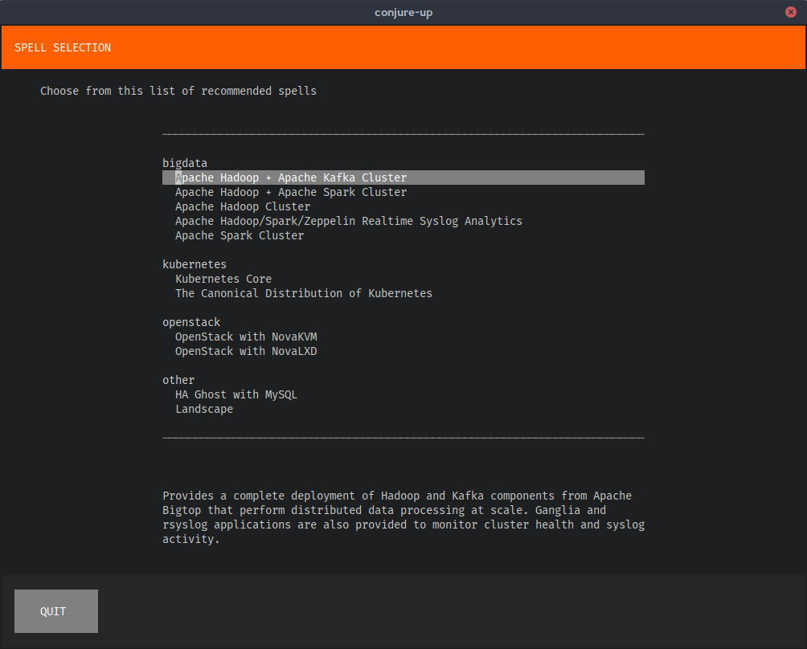
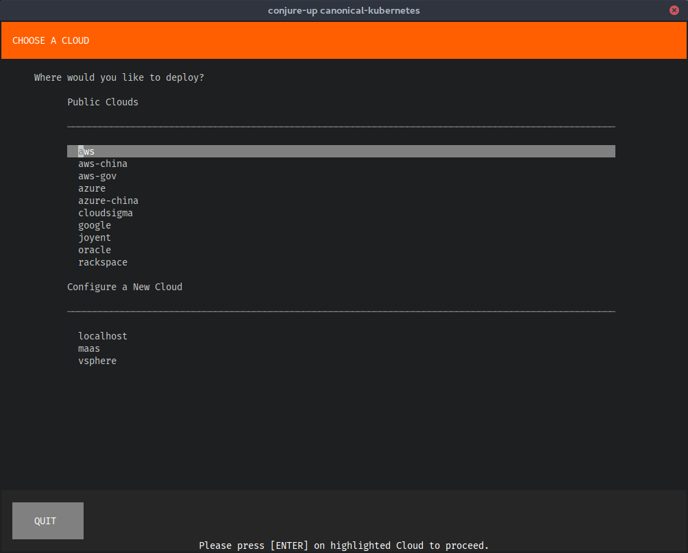
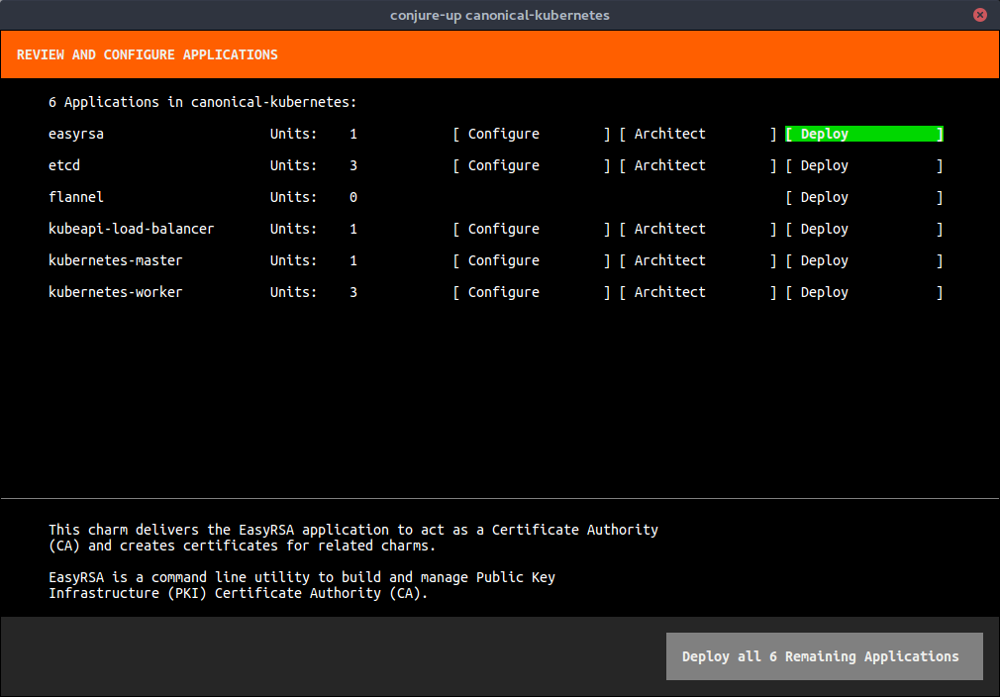
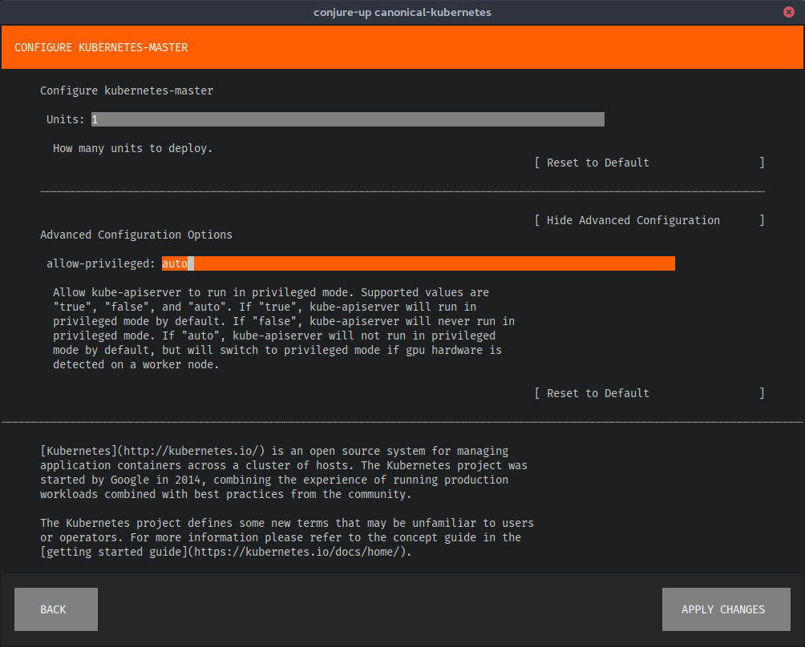
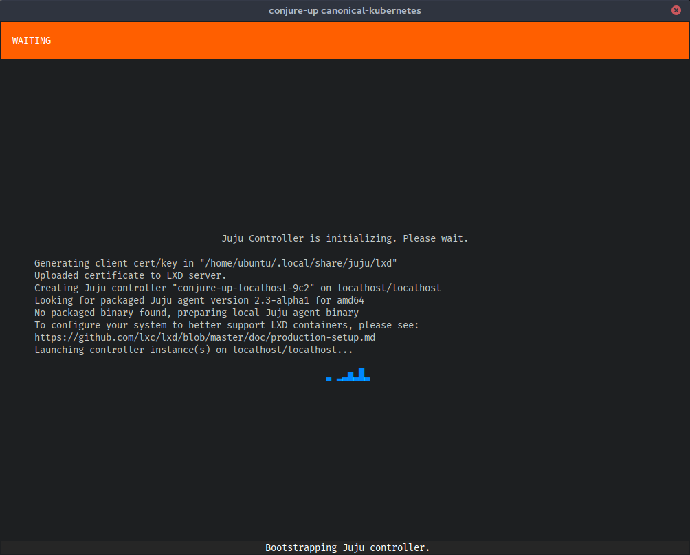
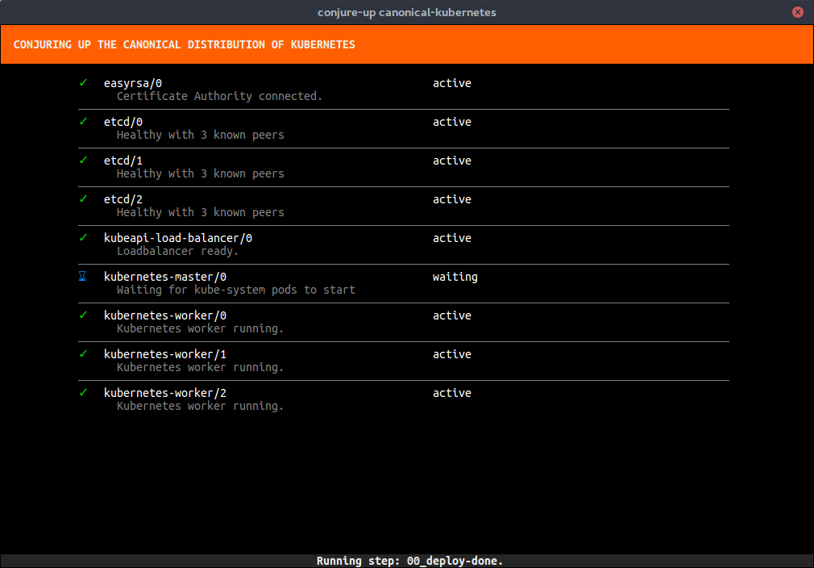
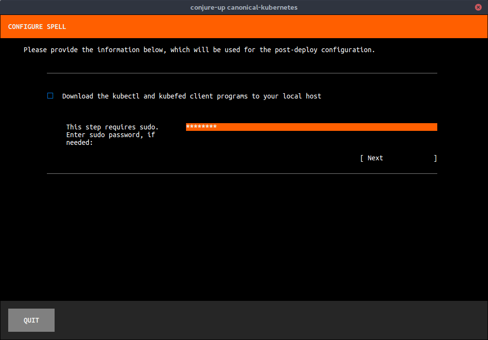
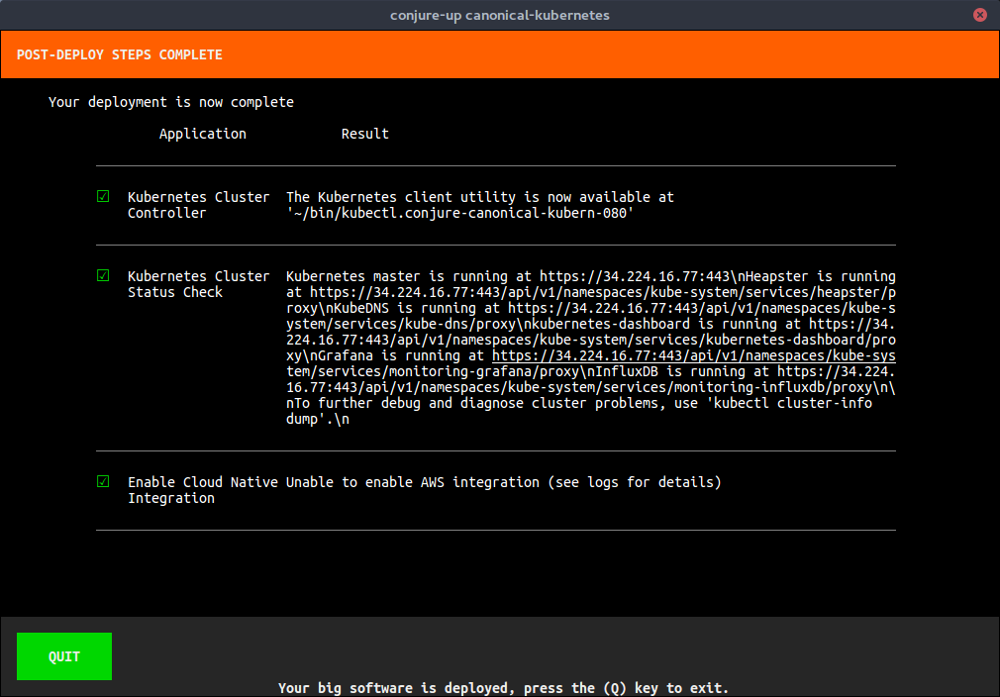

Title: conjure-up | User manual

## **conjure-up** User Manual

**conjure-up** is a thin layer spanning a few different underlying
technologies - [Juju](https://jujucharms.com), [MAAS](http://maas.io), and
[LXD](http://linuxcontainers.org).

**conjure-up** provides you with a streamlined, turnkey solution. In order to
provide that streamlined approach, **conjure-up** makes use of processing
scripts. These scripts are executed at 3 different times in the deployment,
just after a Juju bootstrap, just before a Juju deploy, and right after a Juju
deploy.

Processing scripts give you the flexibility to alter LXD profiles in order to
expose additional network interfaces to Neutron services, import images into
Glance once the service is available, or notifying the Deployment status
screen that your solution is ready and can be viewed at a specific URL.

With these powerful concepts you can package up the solution that can then be
provided to coworkers who can easily deploy your solutions in any Public
Cloud, MAAS, or LXD.


### Getting Started

#### Hardware Requirements

##### Public Cloud

For **Public Cloud** deployments hardware requirements(*constraints*) are
handled by the Spell authors and will automatically be allocated during
deploy.

##### Localhost

For **localhost** deployments the following setup is recommended:

-   2 cores

-   16G RAM

-   32G Swap

-   250G SSD with a seperate block device for ZFS. Our recommendation for that
    device is 100G.

#### Installing conjure-up

conjure-up is available on both Ubuntu Trusty 14.04 LTS and Ubuntu Xenial
16.04 LTS


```bash
sudo snap install conjure-up --classic
```

!!! Note: If above command fails you’ll want to make sure **snapd** is installed with `apt-get install snapd`


##### Ubuntu Trusty 14.04 

Trusty users will need to perform some additional steps prior to getting the
snappy version installed.


To get a working **conjure-up** install on Trusty, the following needs to be run:

```bash
sudo apt-get install snapd
sudo groupadd lxd && sudo usermod -a -G lxd $USER
sudo reboot
sudo snap install conjure-up --classic
```

##### Betas, Development Versions 

You can always test out the latest and greatest (though not necessarily
stable) version with:


```bash
sudo snap install conjure-up --classic --edge
```
... for the very latest version (expect bugs), or:

```
$ sudo snap install conjure-up --classic --beta
```
for the latest beta.


If you have **conjure-up** already installed, you can update to a different 
snap channel with:


```bash
sudo snap refresh conjure-up --classic --edge
```
or

```
sudo snap refresh conjure-up --classic --beta
```

##### Users of LXD 

**conjure-up** currently only supports running a single installation of LXD.
Meaning, systems with LXD pre-installed like Ubuntu Xenial Server should not
have the snapped version of LXD installed.

!!! Note: If you’ve never done anything with [snappy](https://snapcraft.io/) before feel free to skip this section.

You can opt to use either or as **conjure-up** will support LXD versions 2.0.8
and above. To verify that you do only have a single installation of LXD do the
following:


Check  that the output from:

```
snap list
```

does not have **lxd** listed:

```
Name  Version  Rev  Developer  Notes
core  16.04.1  888  canonical  -
```

If **lxd** is listed in the above output, make sure you do not have the Debian
package installed by running :

```bash
dpkg -l lxd
```

In order to fix this problem you’ll want to remove one of those:


For the snap version:


```bash
sudo snap remove lxd
```


For the Debian package:

```bash
sudo apt-get remove lxd lxd-client
sudo apt-get purge lxd
```

#### Summon a Spell

To deploy solutions such as OpenStack you will summon a spell:

```bash
conjure-up openstack
```

To see a list of all available spells run:

```bash
conjure-up
```

!!! Note: Several remote locations are supported - please see [Advanced Spell Summoning](#usage) for further details

#### Uninstalling

To remove deployments:

```bash
conjure-down
```

To uninstall **conjure-up** itself:


```bash
sudo snap remove conjure-up
```

### Spell Walkthrough 

Follow through our screenshot walkthrough of deploying **The Canonical
Distribution of Kubernetes**, Enterprise Kubernetes, anywhere.

#### Spell Selection 

Initially, you will be provided with a list of available spells that can be
deployed. For this walkthrough we will select **Canonical Kubernetes**.

!!! Note:    Once a Spell is selected you can view its **README** at any time by pressing R

***Figure 1: Spell selection***




#### Cloud Selection 

Next, a list of publicly supported clouds will be presented.

***Figure 2: Cloud selection***



#### Application List

Once a cloud is selected you will be presented with a list of applications
that make up the **Canonical Kubernetes** deployment. This screen allows you
to deploy each application individually or make additional configuration
changes to the selected application (covered in [Application
Configuration](#application-config)).

***Figure 3: Application list***



#### Application Configuration 

In the configuration screen for the application you have the ability to
configure certain aspects prior to deployment. For example, in **Figure 4**
you can increase the amount of units to deploy of Elasticsearch.

***Figure 4: Application Config***



#### Bootstrap 

Once the applications are deployed and if no previously bootstrapped cloud
exist you will be presented with a wait screen that gives you the status of
the current bootstrap.

!!! Note: If an existing cloud is already bootstrapped you will not see this view.

***Figure 5:  Bootstrap Wait Screen***



#### Deployment Status 

After the bootstrap process is complete the applications will begin their
deployment tasks. This includes installing the necessary bits onto the
allocated machines, setting their relations between the applications, and
verifying that each application starts successfully. You’ll notice that once
the applications are ready they will have a green checkmark beside them.

***Figure 6: Deployment Status Screen***




#### Additional Application Tasks 

This is the real benefit of **conjure-up**. These additional steps encapsulate
the operational tasks to perform to your deployment in order to start using
your big software. In **Figure 7** you’ll notice that this walks you through
downloading the required **kubectl** tool to work with your new cluster.
Additionally, it’ll contact your cluster and grab the necessary information to
display for you on the [Summary](#summary-screen).


***Figure 7: Steps Configuration***




#### Summary 

Finally, the summary screen presents you with all the information necessary to
access and start using your big software. In **Figure 8** we provide you with
how to access and use your **kubectl** binary along with the Kubernetes
**cluster-info** and how to access the **Kibana** dashboard for viewing things
such as Filebeat and Topbeat.

***Figure 8: Summary***


Pressing `Q` will return you back to the shell with your deployment left intact.

### Advanced Spell Summoning 

**conjure-up** includes several spells in addition to supporting summoning
spells from several remote repositories and from a local directory on your
filesystem.

#### GitHub/BitBucket

Not quite ready to push your spell to the charm registry? That’s ok, simply
push your spell to GitHub and **conjure-up** can deploy from there:


```bash
conjure-up battlemidget/ghost
```

This would pull from GitHub repo <https://github.com/battlemidget/ghost>

#### Remote Web Server

**conjure-up** will also support downloading directly from a webserver. For
example, if you have your spell zipped up and stored at
<http://example.com/my-conjure-spell.zip> you could install it like so:


```bash
conjure-up http://example.com/my-conjure-spell.zip
```


#### Local Filesystem

Passing in either the directory path of the spell or if the current working
directory is a spell:


```bash
conjure-up ~/spells/openstack/openstack-novalxd
```

Or from **cwd**

```bash
~/spells/openstack/openstack-novalxd> conjure-up .
```

#### Running in Headless Mode

**conjure-up** is meant to be a teaching tool in addition to a full blown
application deployment tool. By Default **conjure-up** will walk you through
the entire deployment process and help you understand what it is you are
deploying.


Where this doesn’t make sense is if you are wanting to deploy your application
in an automated fashion. For example, integrating the deployment with a
Jenkins CI server.


For these cases **conjure-up** provides a headless mode.


To deploy in a headless mode you’ll need to have credentials defined if
deploying to a Public Cloud or make sure LXD is configured if deploying to
Localhost.

To deploy OpenStack to a Localhost provider:

```bash
conjure-up openstack-novalxd localhost
```

If we want to deploy to a cloud like AWS:

```bash
conjure-up canonical-kubernetes aws
```


!!! Note: Keep in mind you’ll need to have credentials defined, see [Juju credentials] for more details.


##### Customizing deployment phases 

Currently, if no controller or model is defined during a headless install they
will be auto-generated based on the spell and cloud chosen.


However, those controllers and models can be defined to better reflect your
deployment preferences. For example, you have a controller sitting in a data
center named **dc1** and it houses 3 deployments named **test-deploy,
stage-deploy, and production-deploy**.

To accomplish a naming strategy to reflect this design you can pass in a third
and fourth argument to **conjure-up** to define those phases:


```
conjure-up canonical-kubernetes aws dc1 test-deploy
conjure-up canonical-kubernetes aws dc1 stage-deploy
conjure-up canonical-kubernetes aws dc1 production-deploy
```

##### Customizing headless mode 

Post deployment actions are exposed to the environment via environment
variables. Some actions may require you to input data depending on what is
required. An example would be input the path of your public ssh key so that
your OpenStack deployment can make those available to the compute nodes.

To see what environment variables you can set prior to running a headless mode
install, run the following:

```
conjure-up --show-env openstack-novalxd localhost
```

You should see ouput similar to:

```
Available environment variables:

+--------------+-------------------+---------------------------------------------------------+
| ENV          | DEFAULT           |                                                         |
+--------------+-------------------+---------------------------------------------------------+
| SSHPUBLICKEY | ~/.ssh/id_rsa.pub | Import SSH keypairs into OpenStack. This allows you to  |
|              |                   | access the newly deployed instances via SSH with your   |
|              |                   | current user. If you are not sure about the location of |
|              |                   | a ssh key leave it as is and we will create one         |
|              |                   | automatically.                                          |
+--------------+-------------------+---------------------------------------------------------+

See http://conjure-up.io/docs/en/users/#running-in-headless-mode for more
information on using these variables to further customize your deployment.
```

In order to change it from it’s default of **\~/.ssh/id\_rsa.pub** you would
simply do:


```bash
SSHPUBLICKEY=/home/bob/my-ssh-key.pub conjure-up openstack-novalxd localhost
```

### Advanced Usage/Additional Tips 

#### Running **conjure-up** remotely

If you ssh into a seperate machine to run **conjure-up** and you deploy spells
such as openstack-novalxd to localhost and you want to be able to access
things like the `openstack dashboard`.

The simplest way to accomplish this is on your local machine run the
following:


```bash
sudo apt install sshuttle
sshuttle -r <remote-host-ip> <subnet-of-localhost-deployment>
```

The subnet of localhost is going to be what **conjure-up** configured the
network bridge for. By default this is set to **10.0.8.1/24**. Lets also say
the remote host’s ip is **172.16.0.5** so you’ll want to do the following


```bash
sshuttle -r 172.16.0.5 10.0.8.1/24

[local sudo] Password:
client: Connected.
```

It will then ask you to enter your sudo password and once complete will let
you know that the sshuttle is connected. From there you can open your web
browser and access the horizon dashboard as if it was running on your local
machine.

Assuming the openstack-dashboard was deployed to a machine whose ip is
10.0.8.15, you could run:


```bash
xdg-open https://10.0.8.15/horizon
```


### Troubleshooting

#### Logging 

Logs are written to `journald` by default. Logs
may be viewed with the command:

```bash
journalctl |grep conjure-up
```

!!! Note: There is also a log file that is written to `\$HOME/.cache/conjure-up/conjure-up.log`

#### Unicode 

If the system running `conjure-up` does not have its locale defined to
`UTF-8` a failure will occur similar to:

```
UnicodeDecodeError: 'ascii' codec can't decode byte 0xe2 in position 2201: ordinal not in range(128)
```

To fix you will need to set your locale accordingly. Run the command:

```
locale
```
to view current settings...

```
LANG=en_US.UTF-8
LANGUAGE=en_US
LC_CTYPE="en_US.UTF-8"
LC_NUMERIC="en_US.UTF-8"
LC_TIME="en_US.UTF-8"
LC_COLLATE="en_US.UTF-8"
LC_MONETARY="en_US.UTF-8"
LC_MESSAGES="en_US.UTF-8"
LC_PAPER="en_US.UTF-8"
LC_NAME="en_US.UTF-8"
LC_ADDRESS="en_US.UTF-8"
LC_TELEPHONE="en_US.UTF-8"
LC_MEASUREMENT="en_US.UTF-8"
LC_IDENTIFICATION="en_US.UTF-8"
LC_ALL=
```

### Common Spell Problems 

#### Applications in Error state 

One of the biggest reasons why applications will error out during deployment
is due to not having enough disk space available. Please make sure you meet
the [Hardware Requirements](#hardware-requirements) prior to deploying spells.

#### LXD 

##### Failed deployments if IPv6 is enabled 

Currently **conjure-up** does not support the use of IPv6. If you are running LXD
and have a bridge that has IPv6 enabled **conjure-up** will fail and give you an
explanation as to why and information for disabling IPv6.

###### Disable IPv6 on LXD versions 2.2 and below 

LXD version 2.0 is the default version on Ubuntu Xenial 16.04. To disable IPv6
you’ll need to edit `/etc/default/lxd-bridge` and make sure the following
values are reflected below:

```no-highlight
# IPv6
## IPv6 address (e.g. 2001:470:b368:4242::1)
LXD_IPV6_ADDR=""

### IPv6 CIDR mask (e.g. 64)LXD_IPV6_MASK=""

### IPv6 network (e.g. 2001:470:b368:4242::/64)LXD_IPV6_NETWORK=""

### NAT IPv6 trafficLXD_IPV6_NAT="false"
```

###### Disable IPv6 on LXD versions 2.4 and above 

To disable IPv6 on your LXD bridge (`lxdbr0` by default) run the following:

```bash
lxc network set lxdbr0 ipv6.nat false
lxc network set lxdbr0 ipv6.address none
```

#### OpenStack 

##### Deployment gets part way through and seems to hang under VSphere 

The most common cause of a "hung" deployment running inside VSphere is network
related. The most common solution is to enable promiscuous mode in your
virtual switch, Please see [the VMware KB
article](https://kb.vmware.com/selfservice/microsites/search.do?language=en_US&cmd=displayKC&externalId=1004099)
on enabling that feature.

##### config-changed error for neutron-gateway 

This error can happen if you’ve not set your **bridge-mappings** and
**data-port** during the [Application List](#application-list) portion of the
deployment.


Please see [the Neutron Gateway charm documentation] under **Port
Configuration** for more information.


[Juju credentials]: https://jujucharms.com/docs/stable/credentials
[the Neutron Gateway charm documentation]: https://jujucharms.com/neutron-gateway/

